Diversity in the Workplace
================
Siddhartha Jetti
5/30/2019

# Goal

Diversity, unconscious bias in the workplace and, in general, the way
companies treat their employees are a very important topic. Data science
can help discover potential discriminations by looking at the data and
see if there are segments of employees that are treated worse.

# Challenge Description

There has been lots of talking about diversity in the workplace,
especially in technology. The Head of HR at your company is very
concerned about that and has asked you to analyze internal data about
employees and see whether results suggest that the company is treating
all its employees fairly or not.

Specifically, she gave you the following tasks:

1)  In the company there are 6 levels (described below). Identify, for
    each employee, her corresponding level.

<!-- end list -->

  - Individual Contributors(IC) - they don’t manage anyone
  - Middle Managers(MM) - they are the direct bosses of IC
  - Directors(D) - they are the direct bosses of MM
  - VP - D direct bosses
  - Executives (E) - VP direct bosses
  - CEO - The direct boss of E.

<!-- end list -->

2)  How many people each employee manages? Consider that if John
    directly manages 2 people and these two people manage 5 people each,
    then we conclude that John manages 12 people.

3)  Build a model to predict the salary of each employee. Describe the
    main factors impacting employee salaries. Do you think the company
    has been treating all its employees fairly? What are the next steps
    you would suggest to the Head of HR?

# Data

We have 2 tables downloadable by clicking here.

The 2 tables are:

company\_hierarchy - info about each employee direct boss and her dept

## Columns:

  - employee\_id : the Id of the employee. It is unique by employee and
    can be joined to employee id in the other table
  - boss id : the id of the boss of employee id. It is unique by
    employee and can be joined to employee id in the other table.
  - dept : employee id dept. There are the following departments:
      - Engineering (data science is under engineering)
      - Marketing
      - Sales
      - HR
      - the “CEO” dept just for the CEO, since belongs to all the above
        dept.

employee - info about each employee

## Columns:

  - employee\_id : the Id of the employee. It is unique by employee and
    can be joined to employee id and/or boss id in the other table
  - signing\_bonus : whether the employee got a signing bonus when she
    joined the company (1 -\> yes, 0 -\> no)
  - salary : the current salary of that employee in USD
  - degree level: the highest degree received by the employee.
  - sex: Male/Female
  - yrs\_experience: employee years of work experience

# Problem Setup

``` r
# Load required libraries
library(dplyr)
```

    ## 
    ## Attaching package: 'dplyr'

    ## The following objects are masked from 'package:stats':
    ## 
    ##     filter, lag

    ## The following objects are masked from 'package:base':
    ## 
    ##     intersect, setdiff, setequal, union

``` r
library(ggplot2)
```

    ## Registered S3 methods overwritten by 'ggplot2':
    ##   method         from 
    ##   [.quosures     rlang
    ##   c.quosures     rlang
    ##   print.quosures rlang

``` r
library(randomForest)
```

    ## randomForest 4.6-14

    ## Type rfNews() to see new features/changes/bug fixes.

    ## 
    ## Attaching package: 'randomForest'

    ## The following object is masked from 'package:ggplot2':
    ## 
    ##     margin

    ## The following object is masked from 'package:dplyr':
    ## 
    ##     combine

``` r
# Read in the input data into a dataframe
data_hierarchy <- read.csv("company_hierarchy.csv")
data_employee <- read.csv("employee.csv")
```

# Question 1:

Get the count of reports and level from hierarchy table.

``` r
hierarchy <- data_hierarchy %>%
  filter(!is.na(boss_id))

# Function to count direct/in-direct reports and get the hierarchy level for every employee
countReports <- function(df,id) {
  reports <- df[df$boss_id == id,]
  reports1 <- reports
  len <- nrow(reports)
  level <- ifelse(len == 0, 1, 2)
  while(1){
    reports <- df[df$boss_id %in% reports$employee_id,]
    reports1 <- rbind(reports1, reports)
    if(nrow(reports) == len){
     return(data.frame(employee_id = id, level = level, report_count = nrow(reports1)))
     break
    } 
    len <- nrow(reports)
    level <- level + 1
  }
}

data_reports <- data.frame(employee_id = NULL, level = NULL, report_count = NULL )
emps <- nrow(data_hierarchy)

# Loop through all the employess to get level and reports count.
for(i in 1:emps){ 
  data_reports <- rbind(data_reports, countReports(hierarchy, data_hierarchy$employee_id[i]))
}

# Join hierarchy related information with employee information to form one table
data <- data_reports %>%
  arrange(desc(report_count), employee_id) %>%
  left_join(data_hierarchy, by = "employee_id") %>%
  select(employee_id, dept, level, report_count) %>%
  right_join(data_employee, by = "employee_id") %>%
  mutate(signing_bonus = as.factor(signing_bonus),
         level = as.factor(case_when( level == 3 ~ "MM",
                            level == 4 ~ "D",
                            level == 5 ~ "VP",
                            level == 6 ~ "E",
                            level == 7 ~ "CEO",
                            TRUE ~ "IC" ))
  )
```

# Question 2:

Run descriptive statistics

``` r
# Check datatypes of all the variables in the dataframe
str(data)
```

    ## 'data.frame':    10000 obs. of  9 variables:
    ##  $ employee_id   : int  138719 3192 114657 29039 118607 91334 101901 171111 23443 24195 ...
    ##  $ dept          : Factor w/ 5 levels "CEO","engineering",..: 2 5 5 3 5 5 2 2 5 2 ...
    ##  $ level         : Factor w/ 6 levels "CEO","D","E",..: 4 4 4 4 4 4 5 4 4 4 ...
    ##  $ report_count  : int  0 0 0 0 0 0 6 0 0 0 ...
    ##  $ signing_bonus : Factor w/ 2 levels "0","1": 1 1 1 1 1 1 2 2 2 1 ...
    ##  $ salary        : num  273000 301000 261000 86000 126000 221000 194000 119000 217000 230000 ...
    ##  $ degree_level  : Factor w/ 4 levels "Bachelor","High_School",..: 3 1 3 2 1 4 4 3 4 3 ...
    ##  $ sex           : Factor w/ 2 levels "F","M": 2 1 1 1 1 1 2 1 2 2 ...
    ##  $ yrs_experience: int  2 1 2 4 3 2 12 1 8 4 ...

``` r
# Take a peek at the data
head(data)
```

    ##   employee_id        dept level report_count signing_bonus salary
    ## 1      138719 engineering    IC            0             0 273000
    ## 2        3192       sales    IC            0             0 301000
    ## 3      114657       sales    IC            0             0 261000
    ## 4       29039          HR    IC            0             0  86000
    ## 5      118607       sales    IC            0             0 126000
    ## 6       91334       sales    IC            0             0 221000
    ##   degree_level sex yrs_experience
    ## 1       Master   M              2
    ## 2     Bachelor   F              1
    ## 3       Master   F              2
    ## 4  High_School   F              4
    ## 5     Bachelor   F              3
    ## 6          PhD   F              2

``` r
summary(data)
```

    ##   employee_id              dept      level       report_count     
    ##  Min.   :    40   CEO        :   1   CEO:   1   Min.   :   0.000  
    ##  1st Qu.: 50574   engineering:2696   D  : 159   1st Qu.:   0.000  
    ##  Median : 99244   HR         :1694   E  :   4   Median :   0.000  
    ##  Mean   :100002   marketing  :2010   IC :9001   Mean   :   4.875  
    ##  3rd Qu.:149748   sales      :3599   MM : 800   3rd Qu.:   0.000  
    ##  Max.   :199956                      VP :  35   Max.   :9999.000  
    ##  signing_bonus     salary            degree_level  sex     
    ##  0:6986        Min.   : 60000   Bachelor   :2735   F:3561  
    ##  1:3014        1st Qu.:110000   High_School:1657   M:6439  
    ##                Median :182000   Master     :2786           
    ##                Mean   :189112   PhD        :2822           
    ##                3rd Qu.:255000                              
    ##                Max.   :700000                              
    ##  yrs_experience  
    ##  Min.   : 1.000  
    ##  1st Qu.: 2.000  
    ##  Median : 3.000  
    ##  Mean   : 3.875  
    ##  3rd Qu.: 5.000  
    ##  Max.   :34.000

``` r
# check for duplicate user ids
length(data$user_id) == length(unique(data$user_id))
```

    ## [1] TRUE

Here are some observations about data:

  - There are total of 10000 employees in dataset and each employee id
    is unique
  - The mean and median salary of employess across the company are USD
    182k and 189k respectively.

<!-- end list -->

``` r
# Median is more robust to outliers than mean
salary_dept = data %>%
                filter(!dept %in% c("CEO")) %>%
                group_by(dept) %>%
                summarise(med_salary = median(salary))
ggplot(data = salary_dept, aes(x = dept, y = med_salary))+
       geom_bar(stat = "identity")
```

<!-- -->

It looks like folks in engineering are earning way more than HR and
other depts. This could mean that there is a bias by dept or it could
just be a spurious correlation, which would be known only after building
a model.

``` r
salary_level = data %>%
                group_by(level) %>%
                summarise(med_salary = median(salary)) %>%
                arrange(desc(med_salary))

ggplot(data = salary_level, aes(x = level, y = med_salary))+
       geom_bar(stat = "identity")
```

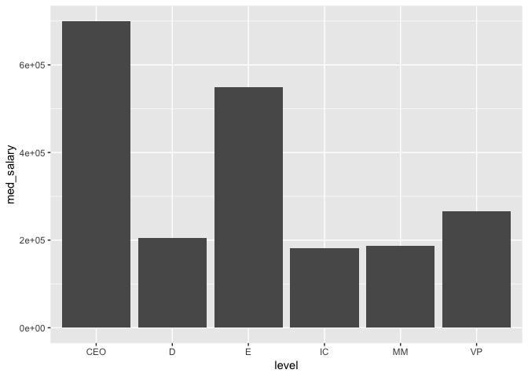<!-- -->
The above plot indicates that median salaries of CEO \> Executive \> VP
\> Director \> MM \> IC which makes sense given the increasing scope and
responsibility.

``` r
salary_degree = data %>%
                group_by(degree_level) %>%
                summarise(med_salary = median(salary)) %>%
                arrange(desc(med_salary))

ggplot(data = salary_degree, aes(x = degree_level, y = med_salary))+
       geom_bar(stat = "identity")
```

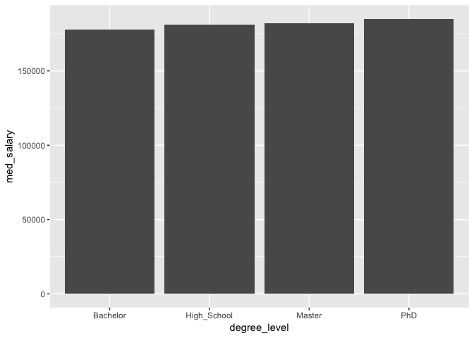<!-- -->

Overall, median salary for bachelor degree graduates is slightly lower
than highschool and increases with advanced degrees. PHD graduates have
the highest median salary. One possible explanation for lower bachelor
graduate salary than high school graduates could be that gains in salary
because of higher degree are nullified by loss of several yrs of
experience (4 or more years).

``` r
salary_gender = data %>%
                group_by(sex) %>%
                summarise(med_salary = median(salary)) %>%
                arrange(desc(med_salary))

ggplot(data = salary_gender, aes(x = sex, y = med_salary))+
       geom_bar(stat = "identity")
```

<!-- -->

The plot shows that median salary of Males is significantly higher than
females. However, This plot alone doesn’t confirm the bias as gender
could be a proxy for other variables like educational degree, year of
experience etc. that are known to determine the salary.

``` r
# Plot salary vs yrs of experience
ggplot(data = data, aes(x = yrs_experience, y = salary)) +
  geom_point() + 
  geom_smooth(method = "loess", se = FALSE)
```

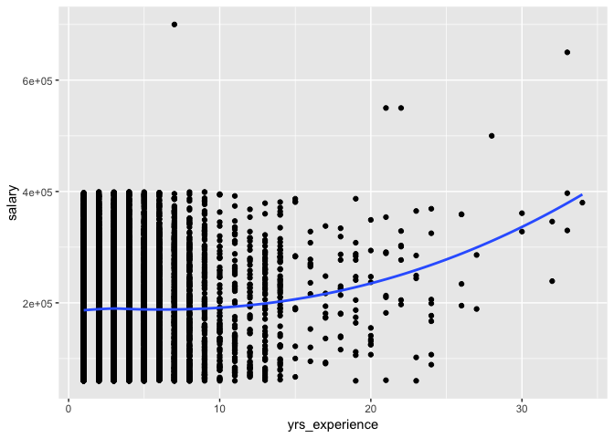<!-- -->

The plot indicates that salaries are expected to increase with yrs of
experience and are expected to grow faster after 10-15 yrs of
experience.

``` r
# Plot salary vs number of reports
data %>%
  filter(report_count > 0) %>%
ggplot(aes(x = report_count, y = salary)) +
  geom_point() + 
  geom_smooth(method = 'loess', se = FALSE)
```

<!-- -->

# Model Building

Random forest would be a good choice for predicting salary as it is
strong with outliers and works well with correlated, continuous and
discrete variables. Also, random forest is easier to optimize
parameters.Partial dependence plots can be used to capture insights from
the model.

A standard 66-30% split can be used to generate training and test
datasets. If training dataset is not large enough then cross validation
can be used to arrive at the optimum parameters

``` r
# Training and test set split
train_sample = sample(nrow(data), size = round(nrow(data)*0.66))
train_data = data[train_sample,]
test_data = data[-train_sample,]

# Build Random forest model on the data with mostly default settings except for class weight and #trees
set.seed(2019)
rf.fit <- randomForest(y=train_data$salary, x = train_data[,-c(6)], ytest = test_data$salary, 
                       xtest = test_data[,-c(6)],  ntree = 250, mtry = 3, keep.forest = TRUE)

rf.fit
```

    ## 
    ## Call:
    ##  randomForest(x = train_data[, -c(6)], y = train_data$salary,      xtest = test_data[, -c(6)], ytest = test_data$salary, ntree = 250,      mtry = 3, keep.forest = TRUE) 
    ##                Type of random forest: regression
    ##                      Number of trees: 250
    ## No. of variables tried at each split: 3
    ## 
    ##           Mean of squared residuals: 5414222079
    ##                     % Var explained: 31.95
    ##                        Test set MSE: 5303848842
    ##                     % Var explained: 32.3

``` r
# Visualize Important variables
varImpPlot(rf.fit)
```

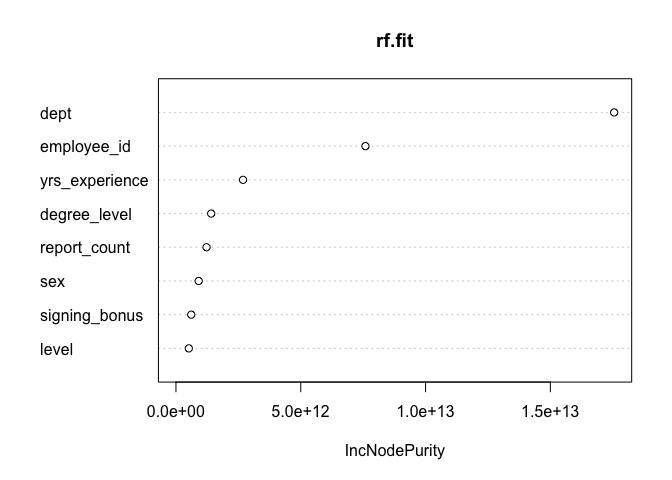<!-- -->
The training and test MSE are close and looks like model is not
overfitting to data. Now, Building the model without the dominating
variable to see if it changes importance of other
variables.

``` r
rf.fit2 <- randomForest(y=train_data$salary, x = train_data[,-c(2,6)], ytest = test_data$salary, 
                       xtest = test_data[,-c(2,6)],  ntree = 250, mtry = 3, keep.forest = TRUE)

rf.fit2
```

    ## 
    ## Call:
    ##  randomForest(x = train_data[, -c(2, 6)], y = train_data$salary,      xtest = test_data[, -c(2, 6)], ytest = test_data$salary,      ntree = 250, mtry = 3, keep.forest = TRUE) 
    ##                Type of random forest: regression
    ##                      Number of trees: 250
    ## No. of variables tried at each split: 3
    ## 
    ##           Mean of squared residuals: 7977232438
    ##                     % Var explained: -0.27
    ##                        Test set MSE: 7746336367
    ##                     % Var explained: 1.12

``` r
# Visualize Important variables
varImpPlot(rf.fit2)
```

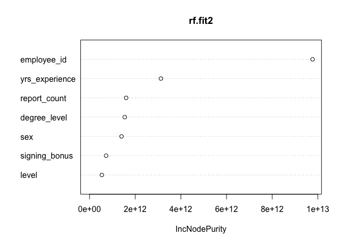<!-- -->

After dropping the dept variable, the variance explained drops
dramatically. So rf.fit is indeed optimal model.

# Question 3:

``` r
# Order variables by importance
imp_vars <- importance(rf.fit)
pdp_vars <- names(sort(imp_vars[,1], decreasing = T))

# Loop through variables and build PDP in the decreasing order of variable importance
for (i in seq_along(pdp_vars)) {
  partialPlot(rf.fit, data[,-6], pdp_vars[i], xlab="",
              main=paste("Partial Dependence on", pdp_vars[i]))
}
```

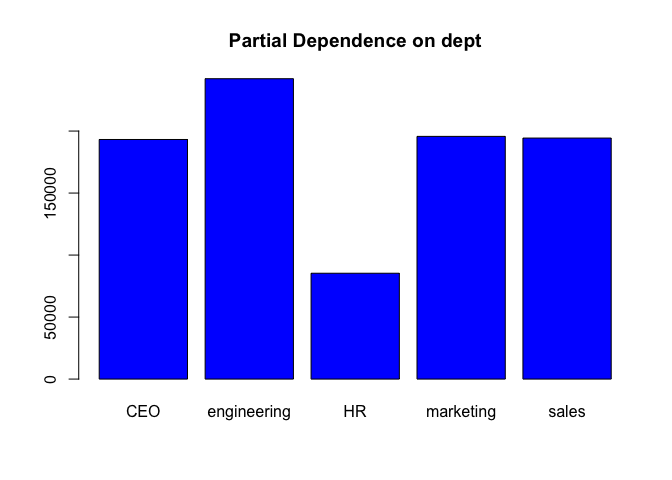<!-- -->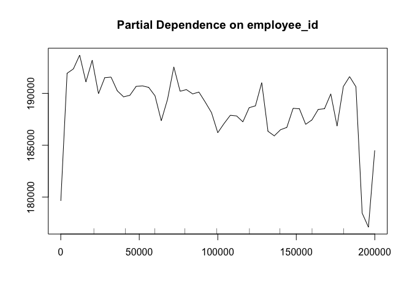<!-- -->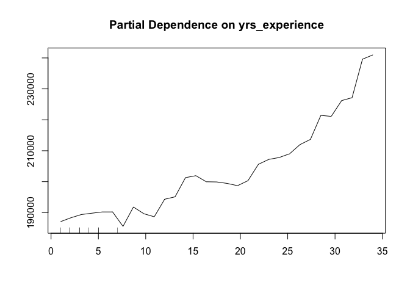<!-- -->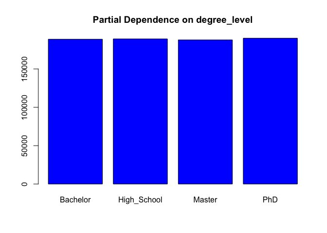<!-- -->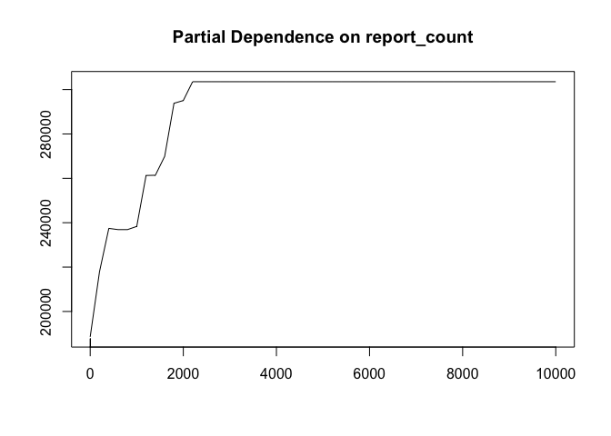<!-- --><!-- -->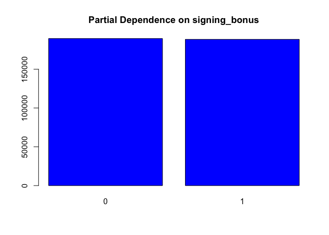<!-- -->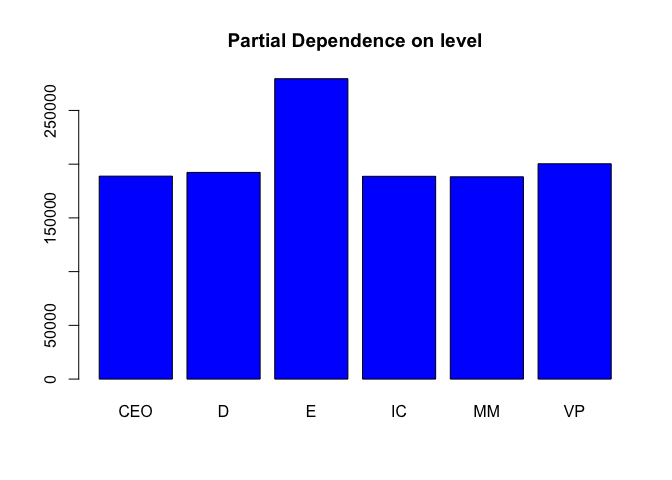<!-- -->

# Understanding Partial Dependence Plots

  - Looking at the variable importance and PD plots, the main factors
    that impact the salaries are dept, yrs of experience and level or
    number of direct/indirect reports.

  - Although the descriptive bar chart of Salary Vs Gender show that
    Females are underpaid compared to Males, after controlling for
    variables like department, yrs of experience and number of reports
    no such bias in salary based on gender exists.

  - The PDP on dept reveals that salaries in engineering are higher than
    any other department and salaries in HR are the lowest.

  - Interestingly after controlling for dept, yrs of experience and
    level, educational degree does not really affect the salary.

  - Signing bonus and gender does not seem to affect the salary.

# Conclusions & next steps

  - Based on the data, the people working in engineering dept are likely
    to get higher salaries than other depts. However, the reason for
    higher salaries could be long work hours, high stress levels,
    scarcity of engineering talent or difficulty in retaining talent
    etc.

  - The next steps for the Head of HR would be to identify the most
    likely reason and try to reduce the salary gap across the depts.
