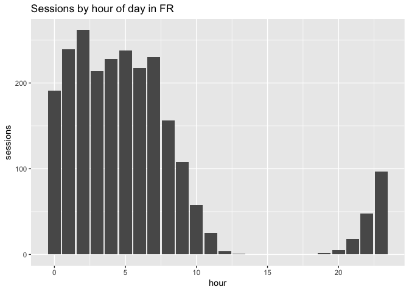
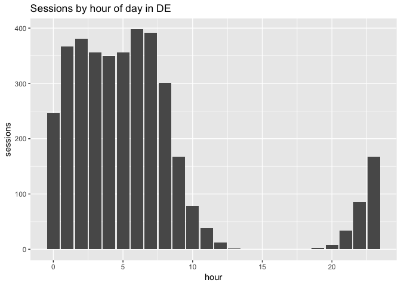
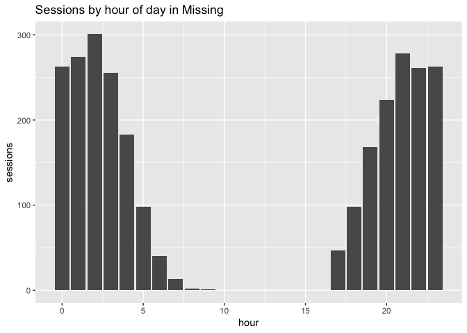
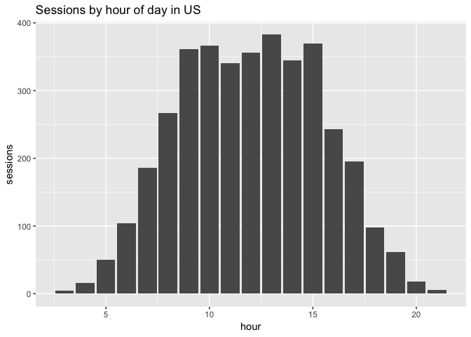
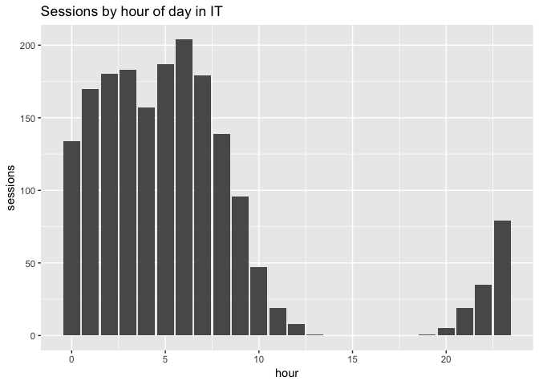
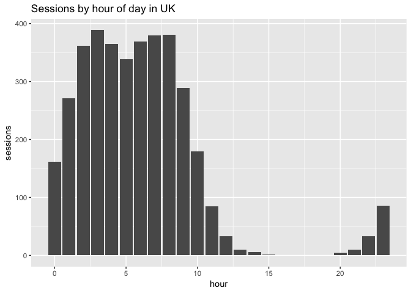
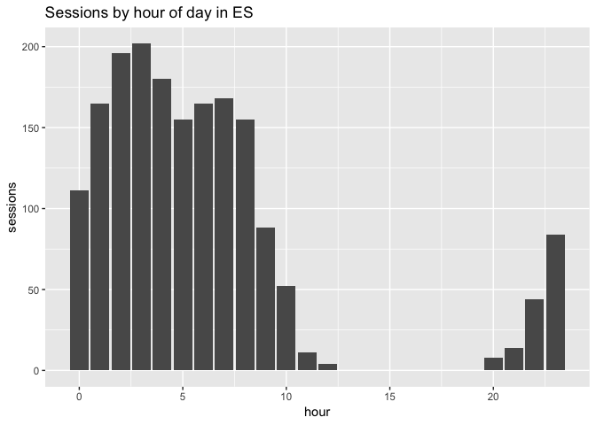

JSON City Similarities
================
Siddhartha Jetti
6/30/2019

# Goal

This is another challenge where your data is stored in a JSON file. Each
row in this JSON stores info about all user searches within a session.

Analyzing user behavior within the same session is often crucial.
Clustering users based on their browsing behavior is probably the most
important step if you want to personalize your site.

The goal of this challenge is to build the foundation of personalization
by identifying searches likely to happen together and cluster users
based on their session searches.

# Challenge Description

Company XYZ is a Online Travel Agent site, such as Expedia, Booking.com,
etc.

They store their data in JSON files. Each row in the json shows all
different cities which have been searched for by a user within the same
session (as well as some other info about the user). That is, if I go to
expedia and look for hotels in NY and SF within the same session, the
corresponding JSON row will show my user id, some basic info about
myself and the two cities.

You are given the following tasks:

1)  There was a bug in the code and one country didn’t get logged. It
    just shows up as an empty field (“”). Can you guess which country
    was that? How?

2)  For each city, find the most likely city to be also searched for
    within the same session.

3)  Travel sites are browsed by two kinds of users. Users who are
    actually planning a trip and users who just dream about a vacation.
    The first ones have obviously a much higher purchasing intent. Users
    planning a trip often search for cities close to each other, while
    users who search for cities far away from each other are often just
    dreaming about a vacation. That is, a user searching for LA, SF and
    Las Vegas in the same session is much more likely to book a hotel
    than a user searching for NY, Paris, Kuala Lumpur (makes sense,
    right?). Based on this idea, come up with an algorithm that clusters
    sessions into two groups: high intent and low intent. Explain all
    assumptions you make along the way.

# Data

The file is

city\_searches - a list of searches happening within the same session

## Fields:

  - session\_id : session id. Unique by row
  - unix\_timestamp : unixtime stamp of when the session started
  - cities : the unique cities which were searched for within the same
    session by a user
  - user : it is has the following nested fields:
  - user\_id: the id of the user
  - joining\_date: when the user created the account
  - country: where the user is based

# Problem Setup

``` r
# Load required libraries
library(tidyverse)
```

    ## Registered S3 methods overwritten by 'ggplot2':
    ##   method         from 
    ##   [.quosures     rlang
    ##   c.quosures     rlang
    ##   print.quosures rlang

    ## ── Attaching packages ──────────────────────────────────────────────────────────────────────────── tidyverse 1.2.1 ──

    ## ✔ ggplot2 3.1.1     ✔ purrr   0.3.2
    ## ✔ tibble  2.1.1     ✔ dplyr   0.8.1
    ## ✔ tidyr   0.8.3     ✔ stringr 1.4.0
    ## ✔ readr   1.3.1     ✔ forcats 0.4.0

    ## ── Conflicts ─────────────────────────────────────────────────────────────────────────────── tidyverse_conflicts() ──
    ## ✖ dplyr::filter() masks stats::filter()
    ## ✖ dplyr::lag()    masks stats::lag()

``` r
library(jsonlite)
```

    ## 
    ## Attaching package: 'jsonlite'

    ## The following object is masked from 'package:purrr':
    ## 
    ##     flatten

``` r
library(lubridate)
```

    ## 
    ## Attaching package: 'lubridate'

    ## The following object is masked from 'package:base':
    ## 
    ##     date

``` r
library(ggplot2)

# Read in the input data into a dataframe
data_json <- fromJSON("city_searches.json")
```

# Question 1:

Transforming the JSON data into a data frame

``` r
session_id <- c()
unix_timestamp <- c()
cities <- c()
user_id <- c()
joining_date <- c()
country <- c()

# Converting the data in the right format
for(i in 1:length(data_json$user)){
  session_id <- c(session_id, data_json$session_id[[i]])
  unix_timestamp <- c(unix_timestamp, data_json$unix_timestamp[[i]])
  cities <- c(cities, data_json$cities[[i]])
  user_id <- c(user_id, data_json$user[[i]][[1]][[1]])
  joining_date <- c(joining_date, data_json$user[[i]][[1]][[2]])
  country <- c(country, data_json$user[[i]][[1]][[3]])
}

# Convert to a data frame
data <- data.frame(session_id = session_id, unix_timestamp = unix_timestamp, cities = cities,
                    user_id = user_id, joining_date = joining_date, country = country, stringsAsFactors = F) %>% 
  mutate(country = ifelse(country == "", "Missing", country))

# Check data types of each of the columns
summary(data)
```

    ##   session_id        unix_timestamp         cities             user_id     
    ##  Length:20022       Min.   :1.425e+09   Length:20022       Min.   :    1  
    ##  Class :character   1st Qu.:1.431e+09   Class :character   1st Qu.: 2768  
    ##  Mode  :character   Median :1.435e+09   Mode  :character   Median : 5513  
    ##                     Mean   :1.435e+09                      Mean   : 5503  
    ##                     3rd Qu.:1.439e+09                      3rd Qu.: 8276  
    ##                     Max.   :1.444e+09                      Max.   :11000  
    ##  joining_date         country         
    ##  Length:20022       Length:20022      
    ##  Class :character   Class :character  
    ##  Mode  :character   Mode  :character  
    ##                                       
    ##                                       
    ## 

``` r
# check if any duplicate session id exist
length(data$session_id) == length(unique(data$session_id))
```

    ## [1] TRUE

``` r
# Check if any missing values exist
colSums(is.na(data) | data == "")
```

    ##     session_id unix_timestamp         cities        user_id   joining_date 
    ##              0              0              0              0              0 
    ##        country 
    ##              0

There are no missing values in input data. Also, session id appears to
be unique.

``` r
# Obtain Time and Hour of day from the time stamp
data <- data %>% 
  mutate(time = as.POSIXct(unix_timestamp, origin = "1970-01-01"), hour = hour(time))

head(data)
```

    ##      session_id unix_timestamp                   cities user_id
    ## 1 D258NVMV202LS     1442640552 San Jose CA, Montreal QC    5749
    ## 2 TDG10UKG7I4LR     1432110137              New York NY   10716
    ## 3 OH4ZDIGN9BLQS     1437049311   Montreal QC, Quebec QC    2941
    ## 4 CWHIAYKQ7RA28     1432215908               Chicago IL    2164
    ## 5 GI8GZJAWAC80P     1443556226   Toronto ON, Houston TX   10493
    ## 6 NRMA4TM621WRD     1426839878              New York NY     326
    ##   joining_date country                time hour
    ## 1   2015-04-02      FR 2015-09-18 22:29:12   22
    ## 2   2015-03-30      DE 2015-05-20 01:22:17    1
    ## 3   2015-03-16 Missing 2015-07-16 05:21:51    5
    ## 4   2015-03-27      FR 2015-05-21 06:45:08    6
    ## 5   2015-03-31      US 2015-09-29 12:50:26   12
    ## 6   2015-03-14      IT 2015-03-20 01:24:38    1

Visualizing the data. Ploting the number of searches by hour of day for
each of the user countries.

``` r
countries <- unique(data$country)

for(i in countries){
  data_country <- data %>%
    filter(country == i) %>%
    group_by(hour) %>%
    summarise(sessions = n())

plot <- ggplot(data = data_country, aes(x = hour, y = sessions)) +
  geom_bar(stat = "identity") +
  ggtitle(paste("Sessions by hour of day in", i, sep=' '))

print(plot)
}
```

<!-- --><!-- --><!-- --><!-- --><!-- --><!-- --><!-- -->

It looks like Unix time stamp is based on one of the time zones in US.

From the sessions Vs Hour of day histogram in US, it is clear that peak
traffic is between 10 AM and 2PM. By assuming similar distribution of
sessions by hour of day in the missing country, The session Vs hour
histogram for Missing country reveals that local time differs by about
11-12 hrs from US. This hints that the missing country could be in Asia
and most likely India or China.

# Question 2:

Each city can be imagined as a point in the n-dimensional space spun by
user sessions. Each coordinate of the point(n-dimensional) would be the
number of searches of the city in the session corresponding to the
cordinate. The goal her is to build city similarity matrix and extract
the most similar city to each of the city searched. The most similar
cities are more likely to be searched together in a session than ones
that are not.

``` r
# Find the maximum number of cities in a given session
# This is done by counting the occurences of "," + 1
max_cities <- max(str_count(data$cities, ",")) + 1

user_city_matrix <- data %>%
  separate(col = cities, into = paste0("city", 1:max_cities), sep = ", ") %>%
  select(-user_id, -joining_date, -country, -time,-hour, -unix_timestamp) %>%
  gather(key = "value", value = "cities", -session_id) %>%
  filter(!is.na(cities)) %>%
  group_by(session_id, cities) %>%
  summarise(nsearches = n()) %>%
  ungroup() %>%
  spread(cities, nsearches) %>%
  mutate_all(funs(replace_na(., 0)))
```

    ## Warning: Expected 8 pieces. Missing pieces filled with `NA` in 20019
    ## rows [1, 2, 3, 4, 5, 6, 7, 8, 9, 10, 11, 12, 13, 14, 15, 16, 17, 18, 19,
    ## 20, ...].

    ## Warning: funs() is soft deprecated as of dplyr 0.8.0
    ## please use list() instead
    ## 
    ##   # Before:
    ##   funs(name = f(.))
    ## 
    ##   # After: 
    ##   list(name = ~ f(.))
    ## This warning is displayed once per session.

``` r
# n-dimensional space
dim(user_city_matrix)
```

    ## [1] 20022    88

``` r
# Take a peek at data
head(user_city_matrix)
```

    ## # A tibble: 6 x 88
    ##   session_id `Anaheim CA` `Arlington TX` `Atlanta GA` `Austin TX`
    ##   <chr>             <dbl>          <dbl>        <dbl>       <dbl>
    ## 1 005DKBSO9…            0              0            0           0
    ## 2 006EM84U6…            0              0            0           0
    ## 3 009CAJV5I…            0              0            0           0
    ## 4 00AR2ULVT…            0              0            0           0
    ## 5 00B1MRZFC…            0              0            0           0
    ## 6 00ECL2HO5…            0              0            0           0
    ## # … with 83 more variables: `Bakersfield CA` <dbl>, `Baltimore MD` <dbl>,
    ## #   `Birmingham AL` <dbl>, `Boston MA` <dbl>, `Buffalo NY` <dbl>, `Calgary
    ## #   AB` <dbl>, `Chandler AZ` <dbl>, `Charlotte NC` <dbl>, `Chesapeake
    ## #   VA` <dbl>, `Chicago IL` <dbl>, `Cincinnati OH` <dbl>, `Cleveland
    ## #   OH` <dbl>, `Columbus OH` <dbl>, `Corpus Christi TX` <dbl>, `Dallas
    ## #   TX` <dbl>, `Detroit MI` <dbl>, `Edmonton AB` <dbl>, `Fort Wayne
    ## #   IN` <dbl>, `Fort Worth TX` <dbl>, `Fresno CA` <dbl>, `Glendale
    ## #   AZ` <dbl>, `Halifax NS` <dbl>, `Hamilton ON` <dbl>, `Hialeah
    ## #   FL` <dbl>, `Houston TX` <dbl>, `Indianapolis IN` <dbl>, `Jacksonville
    ## #   FL` <dbl>, `Jersey City NJ` <dbl>, `Kansas City MO` <dbl>, `Kitchener
    ## #   ON` <dbl>, `Lexington KY` <dbl>, `Lincoln NE` <dbl>, `London
    ## #   ON` <dbl>, `Long Beach CA` <dbl>, `Los Angeles CA` <dbl>, `Louisville
    ## #   KY` <dbl>, `Madison WI` <dbl>, `Memphis TN` <dbl>, `Mesa AZ` <dbl>,
    ## #   `Miami FL` <dbl>, `Milwaukee WI` <dbl>, `Minneapolis MN` <dbl>,
    ## #   `Montreal QC` <dbl>, `Nashville TN` <dbl>, `New York NY` <dbl>,
    ## #   `Newark NJ` <dbl>, `Norfolk VA` <dbl>, `Oakland CA` <dbl>, `Oklahoma
    ## #   City OK` <dbl>, `Omaha NE` <dbl>, `Oshawa ON` <dbl>, `OTTAWA
    ## #   ON` <dbl>, `Philadelphia PA` <dbl>, `Phoenix AZ` <dbl>, `Pittsburgh
    ## #   PA` <dbl>, `Plano TX` <dbl>, `Portland OR` <dbl>, `Quebec QC` <dbl>,
    ## #   `Raleigh NC` <dbl>, `Riverside CA` <dbl>, `Sacramento CA` <dbl>,
    ## #   `Saint Catharines-Niagara ON` <dbl>, `Saint Paul MN` <dbl>, `Saint
    ## #   Petersburg FL` <dbl>, `San Antonio TX` <dbl>, `San Diego CA` <dbl>,
    ## #   `San Francisco CA` <dbl>, `San Jose CA` <dbl>, `Santa Ana CA` <dbl>,
    ## #   `Scottsdale AZ` <dbl>, `Seattle WA` <dbl>, `Stockton CA` <dbl>, `Tampa
    ## #   FL` <dbl>, `Toledo OH` <dbl>, `Toronto ON` <dbl>, `Tucson AZ` <dbl>,
    ## #   `Tulsa OK` <dbl>, `Vancouver BC` <dbl>, `Victoria BC` <dbl>, `Virginia
    ## #   Beach VA` <dbl>, `WASHINGTON DC` <dbl>, `Wichita KS` <dbl>, `Windsor
    ## #   ON` <dbl>

Each city is a point in 20022 dimensions and each cordinate is number of
searches on that city in that session. Cosine similarity is used to
compute similarity between two cities. Most similar cities have cosine
similarity close to 1 and least similar have similarity close to 0.

``` r
user_city_matrix <- user_city_matrix %>%
  select(-session_id)

unique_cities <- colnames(user_city_matrix)

# Define a function to compute the cosine similarity between two cities
cosine_similarity <- function(x, y) { 
  sum(x * y) / (sqrt(sum(x * x)) * sqrt(sum(y * y)))
  }

# Define a place holder to hold similarity between each pair of cities
# similarity between a city and itself is 1
city_similarity  <- diag(1, nrow = ncol(user_city_matrix), ncol = ncol(user_city_matrix))
rownames(city_similarity) <- unique_cities 
colnames(city_similarity) <- unique_cities

ncity <- ncol(user_city_matrix)
```

Now, compute the pair-wise city smilarities and populate the city
similarity matrix.

``` r
# Generate city similarity matrix 
# Loop through the columns
for(i in 1:ncity) {
  # Loop through the columns for each column
  for(j in 1:ncity) {
    # Fill in placeholder with cosine similarities
    city_similarity[i, j] <- cosine_similarity(user_city_matrix[i], user_city_matrix[j])
  }
}

# Take a peek at city 
head(city_similarity[, 1:10])
```

    ##                Anaheim CA Arlington TX Atlanta GA Austin TX Bakersfield CA
    ## Anaheim CA     1.00000000    0.0000000          0 0.0000000     0.05792067
    ## Arlington TX   0.00000000    1.0000000          0 0.2357023     0.00000000
    ## Atlanta GA     0.00000000    0.0000000          1 0.0000000     0.00000000
    ## Austin TX      0.00000000    0.2357023          0 1.0000000     0.00000000
    ## Bakersfield CA 0.05792067    0.0000000          0 0.0000000     1.00000000
    ## Baltimore MD   0.00000000    0.0000000          0 0.0000000     0.00000000
    ##                Baltimore MD Birmingham AL  Boston MA Buffalo NY Calgary AB
    ## Anaheim CA                0       0.00000 0.00000000          0          0
    ## Arlington TX              0       0.00000 0.00000000          0          0
    ## Atlanta GA                0       0.46291 0.00000000          0          0
    ## Austin TX                 0       0.00000 0.00000000          0          0
    ## Bakersfield CA            0       0.00000 0.00000000          0          0
    ## Baltimore MD              1       0.00000 0.03962436          0          0

Most likely city to be searched along with a given city is the city that
has the highest similarity score after
itself.

``` r
likely_searches <- data.frame(City = unique_cities, stringsAsFactors = FALSE)

# We are interested in the most similar city after the city itself.
for(i in 1:length(unique_cities)){
  cities_sorted_similarity <- names(sort(city_similarity[unique_cities[i],], decreasing = TRUE))
  similarity <- sort(city_similarity[unique_cities[i],], decreasing = TRUE)
  city <- cities_sorted_similarity[cities_sorted_similarity != unique_cities[i]][1]
  likely_searches$Most_Similar[i] <- city
  likely_searches$Similarity_score[i] <- city_similarity[unique_cities[i], city]
}

head(likely_searches)
```

    ##             City   Most_Similar Similarity_score
    ## 1     Anaheim CA   Santa Ana CA        0.4504566
    ## 2   Arlington TX  Fort Worth TX        0.4227168
    ## 3     Atlanta GA  Birmingham AL        0.4629100
    ## 4      Austin TX San Antonio TX        0.2878890
    ## 5 Bakersfield CA      Fresno CA        0.3012320
    ## 6   Baltimore MD  WASHINGTON DC        0.3865856

# Question 3:

The goal is to classify multi-city search sessions into high and low
intent based on the distance between searched cities. The straight
forward way to accomplish this is by finding the geographic distance
between each pair of cities and then classify session based on the
obtained distance between the cities. Due to lack of data on the
geographic distance between cities, An in-direct method should be
employed.

The cosine similarity between a pair of cities, each represented by a
vector in n-dimensional user session space, tends to be higher for the
pair of cities that are often searched together. Conversely, the cities
that are not searched together would have lower cosine similarity.

If we assume that users of online travel site have a reasonable intent
to travel then lower cosine similarity between the pair of cities can be
viewed as a proxy for higher distance between them. The similarity score
for multi-city search sessions can be calculated as the average of
cosine similarities between each pair of cities.

Now let us test the assumption using few examples.

``` r
# Top 5 least similar cities with San Jose CA
names(sort(city_similarity["San Jose CA", ]))[1:5]
```

    ## [1] "Arlington TX"  "Atlanta GA"    "Austin TX"     "Baltimore MD" 
    ## [5] "Birmingham AL"

``` r
# Top 5 least similar cities with Miami FL
names(sort(city_similarity["Miami FL", ]))[1:5]
```

    ## [1] "Anaheim CA"     "Arlington TX"   "Austin TX"      "Bakersfield CA"
    ## [5] "Baltimore MD"

``` r
# Top 5 least similar cities with New York NY
names(sort(city_similarity["New York NY", ]))[1:5]
```

    ## [1] "Anaheim CA"     "Arlington TX"   "Atlanta GA"     "Austin TX"     
    ## [5] "Bakersfield CA"

Clearly, the least similar cities are ones from a far away state and in
some cases cities from a different coast. So, Similarity can be used as
a proxy for distance with an inverse relationship.

Now, Computing similarity score for the multi-city sessions.

``` r
# Define a function to compute the similarity score for the session
session_similarity <- function(cities){
  # Get all the cities searched
  searched_cities <- strsplit(cities, split = ", ")[[1]]
  # if only one city is searched then similarity is assigned 0
  if(length(searched_cities) > 1){
    city_pairs <- t(combn(searched_cities, 2))
    similarity <- mean(city_similarity[city_pairs])
  } else { similarity <- NA }
}

# Loop through all the sessions and assign session similarity
for(i in 1:nrow(data)){
  data$session_similarity_score[i] <- session_similarity(data$cities[i])
}

# distribution of session similarity score among sessions with more than one city being searched
quantile(data$session_similarity_score[!is.na(data$session_similarity_score)], probs = seq(0, 1, by = 0.05))
```

    ##          0%          5%         10%         15%         20%         25% 
    ## 0.004461996 0.016250713 0.020937627 0.033736892 0.046620690 0.060735828 
    ##         30%         35%         40%         45%         50%         55% 
    ## 0.069516833 0.079769915 0.091488682 0.102228028 0.125282464 0.169115063 
    ##         60%         65%         70%         75%         80%         85% 
    ## 0.188232257 0.207251104 0.233217004 0.257911298 0.273172252 0.288312295 
    ##         90%         95%        100% 
    ## 0.302803519 0.314322225 0.407752880

``` r
data %>%
  filter(!is.na(session_similarity_score)) %>%
  ggplot()+
  geom_histogram(bins = 50, aes(x = session_similarity_score, y = ..density..))+
  geom_density(aes(x = session_similarity_score, y = ..density..))
```

<!-- -->

From the similarity quantiles and distribution, Looks like 0.06 is a
reasonable cuttoff for session similarity that classifies 25% of
multi-city sessions as low intent and 75% of them as high intent.

``` r
data <- data %>%
  filter(!is.na(session_similarity_score)) %>%
  mutate(Booking_Intent = ifelse(session_similarity_score > 0.06, "High Intent", "Low Intent"))

table(data$Booking_Intent)
```

    ## 
    ## High Intent  Low Intent 
    ##        7122        2347

For sessions with one city search, Unfortunately The data provided is
not sufficient to classify them into high or low intent. However, If
variables like time spent on site or clickstream behavior are provided
it would be possible to classify them.
